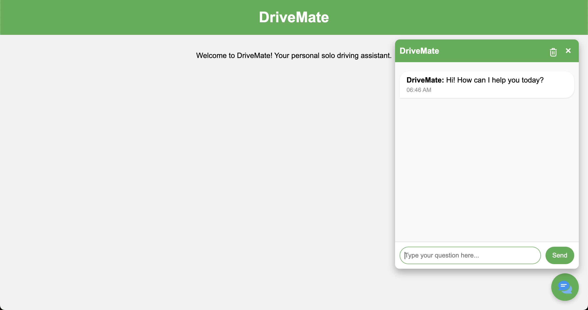
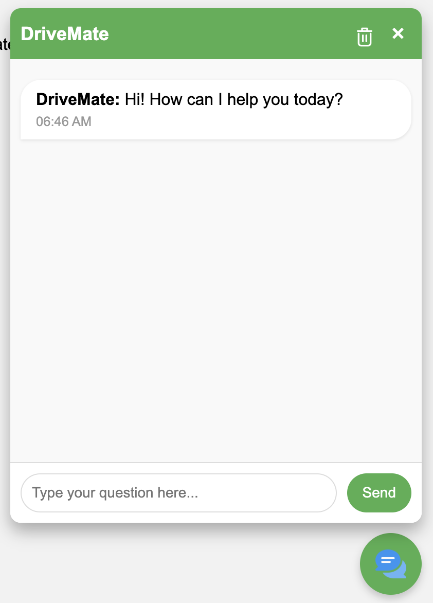

# DriveMate


**DriveMate** is your personal solo driving assistant, designed to enhance your driving experience by providing real-time assistance, navigation, and interactive chat support. Whether you're embarking on a long journey or navigating through city streets, DriveMate is here to help you every step of the way.

## Table of Contents

- [Features](#features)
- [Screenshots](#screenshots)
- [Getting Started](#getting-started)
  - [Prerequisites](#prerequisites)
  - [Installation](#installation)
  - [Configuration](#configuration)
- [Usage](#usage)
- [Contributing](#contributing)
- [License](#license)
- [Contact](#contact)

## Features

- **Interactive Chat Interface:** Engage with DriveMate through a user-friendly chat window.
- **Typewriter Effect:** AI responses are displayed with a realistic typewriter animation.
- **Chat History Management:** Easily clear your chat history with confirmation prompts.
- **Responsive Design:** Seamless experience across desktops, tablets, and mobile devices.
- **Local Storage:** Your chat history is saved locally for easy access and continuity.
- **Accessibility:** Keyboard navigation and ARIA labels ensure usability for all users.

## Screenshots


*DriveMate Chat Interface*


*Responsive Design on Mobile Devices*

## Getting Started

Follow these instructions to set up and run DriveMate on your local machine.

### Prerequisites

- **Python 3.9.21**: Ensure Python is installed. You can download it from [here](https://www.python.org/downloads/).
- **Git**: Install Git from [here](https://git-scm.com/downloads).
- **Virtual Environment (Optional but Recommended)**: Helps manage dependencies.

### Installation

1. **Clone the Repository**

   Open your terminal or command prompt and run:

   ```bash
   git clone https://github.com/vaestrada/DriveMate.git
